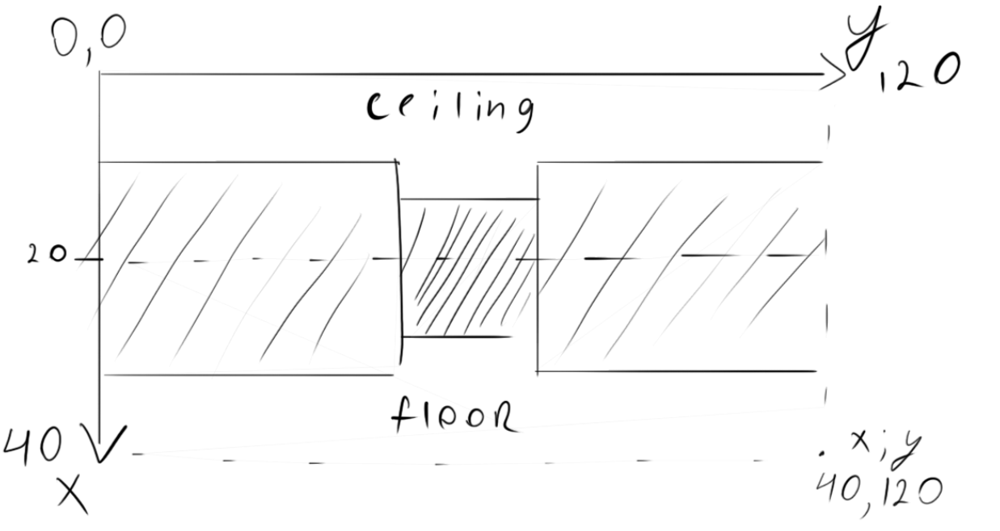

# Console Walker


This is a simple 3D console "game" (if we can call a game something, where we can only walk in 4 directions.) is representing the start of my game engine developing, I think

## Install and run
If you suddenly want to try this out you'll need to have Windows machine because i use Windows API to work with console. 
but if you are lucky one, do `git clone` and then run MSVC or anything that can link `Windows.h`  
(All this oriented on MSVC and I'm not sure about other compilers)

Also, you need to set CMD size to 120x40 with Consolas font at size 16  
You can change that after first run of application by right-clicking on console title bar and specifying properties

## Explanation
This part is trying to describe all what i did here to make it work
+ [Screen update](#screen_update)
+ [Map](#map)
+ [How to start see](#how_to_see)
+ [We will walk!](#walk)
+ [Adding collision](#collision)
+ [Adding diversity](#diversity)
+ [Information is everything](#info)
+ [Final touch](#final)

### <a name="screen_update"/>Screen update
If we try something like
```C++
std::cout << frameBuffer << std::endl;
```
we suddenly understand that it's very, very slow (I can't say exact numbers, but we surely couldn't get 400-600 FPS in Debug mode and 2200 FPS in Release mode on Intel UHD 630)

It's not because people who wrote C++ standard library is dumb, it's the opposite-they are very clever and try to give your powerful tool for console output
(somebody wrote tic-tac toe on printf(), so... [Yeah, it's really a tic-tac toe](https://www.ioccc.org/2020/carlini/index.html))

But we need something simple-just command line which we can fill with data.
So, here we are using `Windows.h`

```C++
//screen size constants(that's why window must be 120x40 characters)
const int screenWidth = 120;
const int screenHeight = 40;

    wchar_t* screen = new wchar_t[screenHeight * screenWidth];
    HANDLE console = CreateConsoleScreenBuffer(GENERIC_READ | GENERIC_WRITE, 0, NULL, CONSOLE_TEXTMODE_BUFFER, NULL);
    SetConsoleActiveScreenBuffer(console);
    DWORD bytesWritten = 0;
while(1){
    //Here is our logic!

    screen[screenHeight * screenWidth - 1] = '\0';
    WriteConsoleOutputCharacter(console, screen, screenHeight * screenWidth, { 0,0 }, &bytesWritten);
}
```
Voila! we have our main game loop that render screen and does all logic

### <a name="map"/>Map
I think that clear world without everything is a little bit boring, so let's add map!
we'll create map `16x16` "cells"
I'll use `wchat_t` because `WriteConsoleOutputCharacter` consumes only `wchar_t`

```C++
//Don't forget to change that!
int mapHeight = 16; 
int mapWidth = 16;

/*some code..*/

std::wstring map;

map += L"################";
map += L"#..............#";
map += L"#..............#";
map += L"#..............#";
map += L"#..............#";
map += L"#..............#";
map += L"#..............#";
map += L"#..............#";
map += L"#..............#";
map += L"#..............#";
map += L"#..............#";
map += L"#..............#";
map += L"#..............#";
map += L"#..............#";
map += L"#..............#";
map += L"################";

```
Now we got our precious empty room! Symbol `#` will be our wall, and symbol `.` will be free space

### <a name="how_to_see"/>How to start see
We will use one of the most well-known methods of rendering - Ray casting!  
All like in `Wolfenstein 3D` (you can look how it looks like here: [wikipedia](https://en.wikipedia.org/wiki/Wolfenstein_3D#Development)  
Now, when you know how it looks, let's implement it
in our main loop every iteration we will launch 120 rays(guess why) and try to find everything that our player see
so we add rayAngle to determine where is player looking.  
Now, in our loop we will create another loop that will try to find distance to wall.  
First things first, we will try to find the ceiling and floor to create illusion of depth.  
For that, we need to understand something:

This is how our world will look. Illusion of depth is building on distance to wall (all this code is insight ray-casting loop)
so, the further the wall is, the smaller is this look. To do this, we will calculate ceiling from the upper half of screen (from 0 to 20)
And to make walls look bigger we just minus the height divided by distance to wall.
By doing that we imitating illusion, that the closer the object, the bigger it is.  
Let's look at example: `height - height/distance` transforms into `20 - 20/2` and that means that ceiling for this specific wall located from 0 to 10  
In code it will look like this:
```C++
int ceiling = (float)(screenHeight / 2.0f) - screenHeight / ((float)distanceToWall);
int floor = screenHeight - ceiling;

//calculating the distance
for (int y = 0; y < screenHeight; y++) {
    if (y <= ceiling)
        screen[y * screenWidth + x] = ' ';
    else if (y > ceiling && y <= floor)
        screen[y * screenWidth + x] = '#';
    else
        screen[y * screenWidth + x] = ' ';
}
``` 
Now we need something to look around(by lovely WinAPI)
```C++
if (GetAsyncKeyState((unsigned short)'A') & 0x8000) {
    playerAngle -= (0.9);
}
if (GetAsyncKeyState((unsigned short)'D') & 0x8000) {
    playerAngle += (0.9);
}
```
Okay, let's run it. We will see something like this:
  
I think that camera can move faster than in gif. That's because we are right now doing `+0.9f` in like 400FPS
Let's fix it by counting the time between iterations and multiplying by that amount:
```C++
if (GetAsyncKeyState((unsigned short)'A') & 0x8000) {
    playerAngle -= (0.9)* ElapsedTime;
}
if (GetAsyncKeyState((unsigned short)'D') & 0x8000) {
    playerAngle += (0.9)* ElapsedTime;
}
```

### <a name="walk"/>We will walk!
Now, let's try to walk
```C++
if (GetAsyncKeyState((unsigned short)'W') & 0x8000) {
    playerX += std::sinf(playerAngle) * 5.0f * ElapsedTime;
    playerY += std::cosf(playerAngle) * 5.0f * ElapsedTime;
}
if (GetAsyncKeyState((unsigned short)'S') & 0x8000) {
    playerX -= std::sinf(playerAngle) * 5.0f * ElapsedTime;
    playerY -= std::cosf(playerAngle) * 5.0f * ElapsedTime;
}
```
`playerAngle` - unit vector of where our player is looking.  
We are using `sin` and `cos` to count this for x and y coordinate.
This works because if we draw a circle and try to find `sin` we will find x position and by `cos` we will find y position(that's how i understood that, may be i am wrong)  
Math is incredible.

### <a name="collision"/>Adding collision
Collision is simple. We just check, if we are standing in wall, and if yes, cancel this move. That's all
```C++
if (GetAsyncKeyState((unsigned short)'W') & 0x8000) {
    playerX += std::sinf(playerAngle) * 5.0f * ElapsedTime;
    playerY += std::cosf(playerAngle) * 5.0f * ElapsedTime;
    if (map[(int)playerY * mapWidth + (int)playerX] == '#') {
        playerX -= std::sinf(playerAngle) * 5.0f * ElapsedTime;
        playerY -= std::cosf(playerAngle) * 5.0f * ElapsedTime;
    }
}
if (GetAsyncKeyState((unsigned short)'S') & 0x8000) {
    playerX -= std::sinf(playerAngle) * 5.0f * ElapsedTime;
    playerY -= std::cosf(playerAngle) * 5.0f * ElapsedTime;
    if (map[(int)playerY * mapWidth + (int)playerX] == '#') {
        playerX += std::sinf(playerAngle) * 5.0f * ElapsedTime;
        playerY += std::cosf(playerAngle) * 5.0f * ElapsedTime;
    }
}
```
That's all, honestly

### <a name="diversity"/>Adding diversity
Let's use the info about how far the wall to change it's color

```C++
short shade = ' ';

//look at extended ascii-table

if (distanceToWall <= depth / 4.0f)			shade = 0x2588; // Very close
else if (distanceToWall < depth / 3.0f)		shade = 0x2593;
else if (distanceToWall < depth / 2.0f)		shade = 0x2592;
else if (distanceToWall < depth)			shade = 0x2591;
else										shade = ' ';		// too far
```
Now it looks much prettier and we can distinguish close and far walls
Let's do this with floor too! We will change our loop that is trying to understand where is wall, ceiling and floor
```C++
for (int y = 0; y < screenHeight; y++) {
    if (y <= ceiling) {
        screen[y * screenWidth + x] = ' ';
    }
    else if (y > ceiling && y <= floor) {
        screen[y * screenWidth + x] = shade;
    }
    else {
        //shading floor based on distance
        float b = 1.0f - (((float)y - screenHeight / 2.0f) / ((float)screenHeight / 2.0f));
        if (b < 0.25f)      shade = '#';
        else if (b < 0.5f)  shade = 'x';
        else if (b < 0.75f) shade = '.';
        else if (b < 0.9f)  shade = '-';
        else                shade = ' ';

        screen[y * screenWidth + x] = shade;
    }
}
```

### <a name="info"/>Information is everything
Also, let's add map and player position with other additional info.
This will be on the bottom of our loop:
```C++
//Display stats
swprintf_s(screen, 40, L"X=%3.2f, Y=%3.2f, A=%3.2f, FPS=%3.2f", playerX, playerY, playerAngle, 1.0f/ElapsedTime);

//Display map
for (int nx = 0; nx < mapWidth; nx++) {
    for (int ny = 0; ny < mapWidth; ny++) {
        screen[(ny + 1) * screenWidth + nx] = map[ny * mapWidth + nx];
    }
}

screen[(int)playerY * screenWidth + (int)playerX] = 'P';
```
### <a name="final"/>Final touch
Now the tough thing in all program.  
We will determine the corner of every wall to make it look not like one wall of characters.  
To do that we need to see understand the concept:

How we can din the corners? We already have rays that finds distance to wall, so...  
Let's determine the wall and cast ray from corner to the player, and if we have ray that is very close to the current ray, we will be sure that it's corner

Here blue ray - from player, while red - from wall
Also we need to understand that we could have rendering problem:

In that situation we will draw 2 corners and will have graphical error
To fix that, we will draw only 2 nearest corners. Yeah..
```C++
for (int tx = 0; tx < 2; tx++) {
    for (int ty = 0; ty < 2; ty++) {
    
        float vector_y = (float)testY + ty - playerY;
        float vector_x = (float)testX + tx - playerX;
        //magnitude of vector
        float d = sqrt(vector_x * vector_x + vector_y * vector_y);
        //dot product
        float dot = (eyeX * vector_x / d) + (eyeY * vector_y / d);
        p.push_back(std::make_pair(d, dot));
    }

std::sort(p.begin(), p.end(), [](const std::pair<float, float>&left,const std::pair<float, float>& right) {return left.first < right.first; });

float bound = 0.01f;

//vectors are sorted, so..
if (std::acos(p.at(0).second) < bound) boundary = true;
if (std::acos(p.at(1).second) < bound) boundary = true;

}
```
Here we are using and `std::sort` vector of pairs, knowledge of dot product only for one thing - find 2 near corners  

---
And finally, after this manipulations our "game" is ready!  
Final result in `ConsoleWalker.cpp`